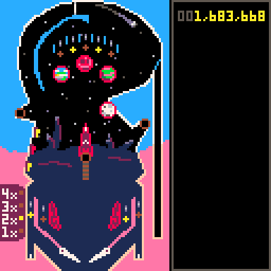

# Terra Nova Pinball
Explore a distant, alien world in this Pico-8 pinball table.

**Pre-Alpha**: Terra Nova pinball is currently under active development, is missing major features and is likely to change frequently.

## Controls
- ⬅️/➡️: Controls the left/right flippers respectively (default, can be changed in the menu).

**Debug (only works with default controls):**
- 🅾️: Add a new pinball to the table.
- ❎: Show/hide the colliders

Terra Nova Pinball by Matt Sutton is licensed under a [Creative Commons Attribution-NonCommercial 4.0 International License](http://creativecommons.org/licenses/by-nc/4.0/).
