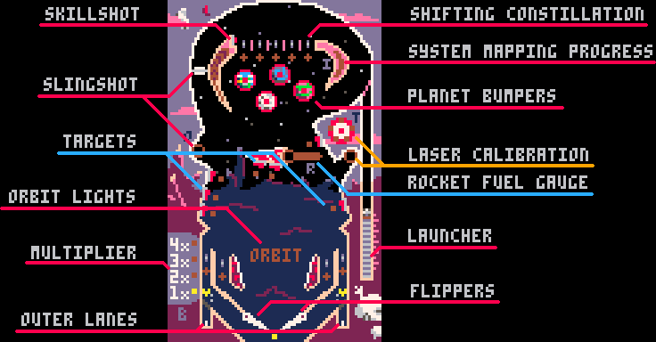

# Terra Nova Pinball
Ricochet around an alien world in this Pico-8 pinball table.

## Basic Gameplay
Launch the ball onto the table using ⬆️/⬇️ to control the launch power and 🅾️/❎ to release the ball.

Use the flippers (⬅️/➡️ by default, can be configured in the menu) to keep the ball from draining out the bottom of the table, hitting targets and bumpers and completing minigames (see below) to score points.

You have 3 balls to score as many points as you can, and record a new highscore!

If the ball drains within 15s of launching, you get a free relaunch.

Highscores are saved on the cart and can be viewed from the main menu.

## Table layout

### Skillshot

Launch the ball so it hits the skillshot to score 250,000 points! Can only be got straight after launching the ball.

### Outer lanes

If your ball goes down the outer lane, it'll be kicked back up onto the field - the first time. After this, the lane closes and any balls that go down them will drain out of the bottom.

These lanes reset after the ball drains, or if you light all of the targets in the associated group (the leftmost 3 of the left lane, and the rightmost 2 for the right lane).

### Slingshot

Shoot the ball around the top, lighting up the spinner and landing in the left kick-out hole to score a **Slingshot!**

This scores 50,000 points and lights up the letter **'O' in ORBIT**.

### Shifting Constellation

Passing the ball through one of the gaps at the top of the table will trigger the associated rollover and light one of the stars in this constellation.

If you light all 5, you'll increase the **multiplier**, applying a 2x, 3x or even 4x bonus to all points you score. You'll also light the **'B' in ORBIT**.

To help you light them all, you can shift which stars are lit left and right using the flippers.

### Mapping the Solar System

Bounce the ball off of the **planet bumpers** at the top of the table to collect data about the solar system - the bar to the right of them tracks your progress. If you can fill it up, you'll score 500,000 points and light up the letter **'I' in ORBIT**.

However, beware of orbital drift - the progress bar will drain over time, so you'll need to keep hitting the planet bumpers to fill it up.

### Refueling the rocket

Each time the ball passes down over one of the rollovers in each of the lanes at the bottom of the board, the rocket will be partially refueled.

Trigger these 5 times to fill the **rocket fuel gauge**, and then land your ball in the kick-out hole at the base of the rocket to ignite **Blast-off!**!

This scores 243,000 points, unleashes 3 balls onto the board (which will be automatically replaced for 20 seconds!) and lights up the letter **'R' in ORBIT**.

However, if you drain the ball, the gauge will empty. And if you ignite the engine before it's fully fueled, you'll just get partial points, with no multi-ball and no 'R'.

### Calibrating the lasers

Land the ball in the rightmost kick-out hole to start some target practice to calibrate the weapons systems.

The light in front of one of the targets will start to blink - you'll then have 30s to hit that target. Then another will light up, and you'll have another 30s. Hit five of these without the timer running out, and you'll score 500,000 points and light up the letter **'T' in ORBIT**.

Landing the ball in the kick-out hole while the target practice is ongoing will reset the timer back to a full 30s, giving you a bit more time.

### Achieving ORBIT

Light all 5 letters in ORBIT and you'll score 3,000,000 points and gain a bonus ball.

The letter will even reset - if you're skilled enough to light them all again. 

## License

Terra Nova Pinball by Matt Sutton is licensed under a [Creative Commons Attribution-NonCommercial 4.0 International License](http://creativecommons.org/licenses/by-nc/4.0/).
